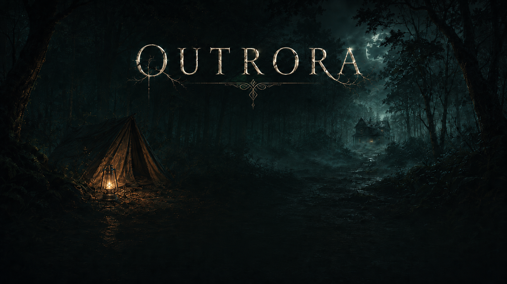

# Outrora

RPG **interativo** onde suas escolhas moldam o desenvolvimento da história.



---

## Visão geral

**Outrora** é um jogo narrativo feito em **Python** com **Kivy/KivyMD**, focado em decisões do jogador, ramificações e progressão da história.

---

## Tecnologias / Frameworks


---

## Requisitos

- **Python 3.8 a 3.13**  
  - Recomendado no Windows: **Python 3.12** ou **3.13**
- Dependências instaladas via `requirements.txt`

> Dica: usar ambiente virtual (`venv`) ajuda a evitar conflitos de dependências.

---

## Estrutura do projeto

```text
.
├── .gitattributes
├── .gitignore
├── LICENSE
├── README.md
├── main.py
├── requirements.txt
├── data/
│   ├── __init__.py
│   └── story.py
└── assets/
    ├── images/
    └── audio/
```

### Pastas e arquivos principais

- `main.py`: ponto de entrada da aplicação.
- `data/story.py`: dados/estrutura da história (ex.: cenas, escolhas e consequências).
- `assets/`: recursos do jogo (imagens e áudio).

---

## Como executar (Windows / Linux / macOS)

### 1) Clonar o repositório

```bash
git clone https://github.com/diegobrnrd/outrora.git
cd outrora
```

### 2) Criar e ativar um ambiente virtual (recomendado)

Criar:

```bash
python -m venv .venv
```

Ativar:

- Windows (PowerShell):
  ```powershell
  .\.venv\Scripts\Activate.ps1
  ```
- Windows (cmd):
  ```bat
  .\.venv\Scripts\activate.bat
  ```
- Linux/macOS:
  ```bash
  source .venv/bin/activate
  ```

### 3) Instalar dependências

```bash
pip install -r requirements.txt
```

### 4) Rodar o jogo

```bash
python main.py
```

---

## Solução de problemas (rápido)

- **`python` não encontrado**: verifique se o Python está instalado e no `PATH`.
- **Erro ao instalar dependências**: atualize o pip:
  ```bash
  python -m pip install --upgrade pip
  ```
- **Ambiente virtual não ativa no PowerShell**: talvez seja necessário liberar scripts:
  ```powershell
  Set-ExecutionPolicy -Scope CurrentUser RemoteSigned
  ```

---

## Roadmap (opcional)

- [ ] Novas ramificações e finais alternativos
- [ ] Melhorias na UI/UX
- [ ] Trilha sonora e efeitos sonoros integrados
- [ ] Empacotamento para Windows (executável)

---

## Licença

Este projeto está licenciado sob a **Apache License 2.0**.  
Veja o arquivo [LICENSE](LICENSE).

---

## Autor

Feito por **Diego** ([@diegobrnrd](https://github.com/diegobrnrd)).
