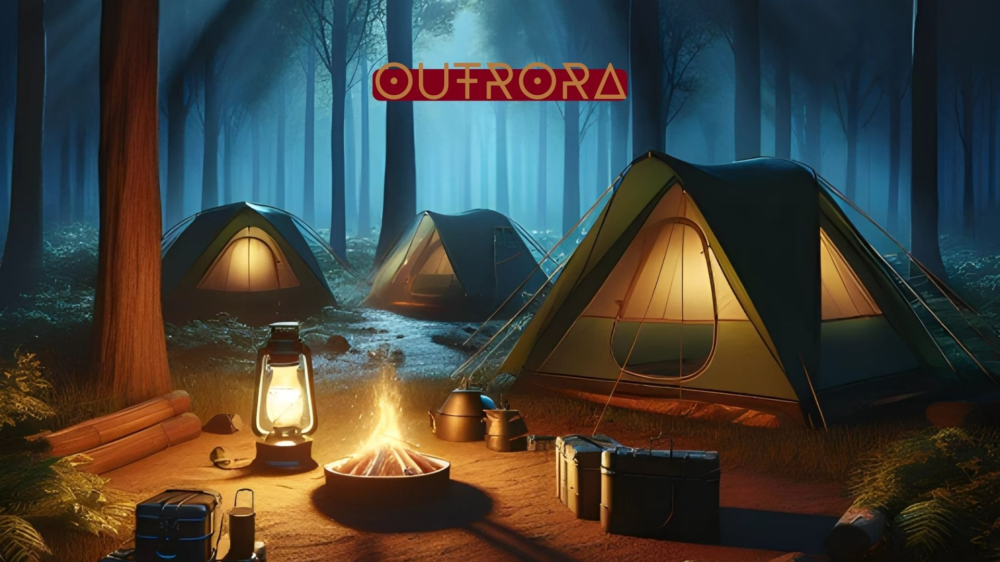
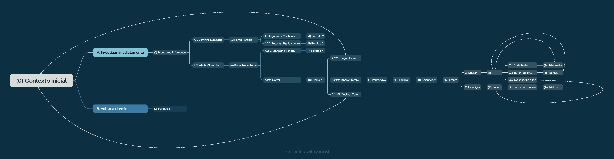

# Outrora

RPG interativo onde as escolhas do jogador moldam o desenvolvimento da história.



Projeto elaborado como componente da disciplina PISI I (Projeto Interdisciplinar de Sistemas de Informação I).

## Descrição do Projeto

O projeto trata-se de um RPG interativo onde as escolhas do jogador moldam o desenvolvimento da história.

## Tecnologias / Framework

- Python
- Kivy
- KivyMD

## Pré-requisitos

- **Python 3.8 a 3.13** (recomendado no Windows: **3.12** ou **3.13**)
- Dependências instaladas via `requirements.txt`

## Estrutura do projeto

```text
.
├── main.py
├── requirements.txt
├── data/
│   ├── __init__.py
│   └── story.py
└── assets/
    ├── images/
    ├── audio/
    └── video/
```

## Como executar (Windows / Linux / macOS)

### 1) Clonar o repositório

```bash
git clone https://github.com/diegobrnrd/outrora.git
cd outrora
```

### 2) Criar e ativar um ambiente virtual (recomendado)

Criar:

```bash
python -m venv .venv
```

Ativar:

- Windows (PowerShell):
  ```powershell
  .\.venv\Scripts\Activate.ps1
  ```
- Windows (cmd):
  ```bat
  .\.venv\Scripts\activate.bat
  ```
- Linux/macOS:
  ```bash
  source .venv/bin/activate
  ```

### 3) Instalar dependências

```bash
pip install -r requirements.txt
```

### 4) Rodar o jogo

```bash
python main.py
```

## Assets (arquivos de mídia)

O jogo depende dos arquivos dentro da pasta `assets/`:

- `assets/images/` (imagens)
- `assets/audio/` (músicas)
- `assets/video/` (vídeos)

Arquivos esperados (exemplo):

- `assets/images/tela_inicial.jpg`
- `assets/images/historia.jpg`
- `assets/images/Outrora.png`
- `assets/audio/musica.mp3`
- `assets/audio/musica_2.mp3`
- `assets/audio/musica_3.mp3`
- `assets/audio/musica_4.mp3`
- `assets/video/creditos.mp4`

## Vídeo de créditos

O jogo tenta reproduzir `assets/video/creditos.mp4`.

- Com `ffpyplayer` instalado, o vídeo roda normalmente.
- Caso o provedor de vídeo não esteja disponível no ambiente, o jogo exibe automaticamente uma tela de créditos alternativa (fallback) com texto e botão de fechar.

## Narrativa

Utilizei o Xmind para elaborar o mapeamento da narrativa do jogo.



## Licença

Este projeto está licenciado sob a [Apache License 2.0](LICENSE).
